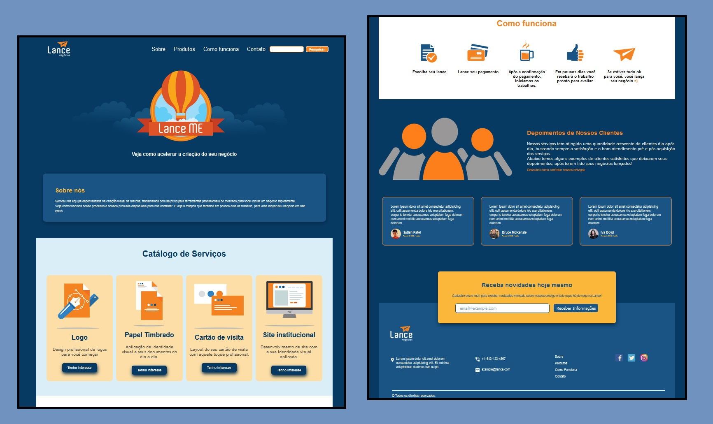

## 📝 lance-negocios
Projeto de criação de Landing Page de uma vitrine de serviços.

## 💻 Screenshot do projeto
- Designer 01

<h4 align="center"><a href="https://brunooliveira16.github.io/landing-page-lance/">Clique aqui e visite o projeto</a></h4>

## 📚 Descrição

Construir uma página que possa oferecer uma experiência agrádavel ao usuário, para que ele possa decidir o serviço que deseja adquirir.
- **Layout Responsivo:** Visualize o layout ideal para o site, dependendo do tamanho da tela do dispositivo;
- **Interação dos elementos:** Veja os estados de foco para todos os elementos interativos na página;
- **Animações CSS:** Veja as mudanças dos elementos através de animações criadas com css;
- **Aplicação Sass:** Aplicar a estilização da página com o sass, tornando o projeto mais robusto e profissional;
---

## 💼 Tecnologias utilizadas

- HTML;
- CSS;
- Sass;

---
## 🙋🏻‍♂️ Autor

Bruno Oliveira
